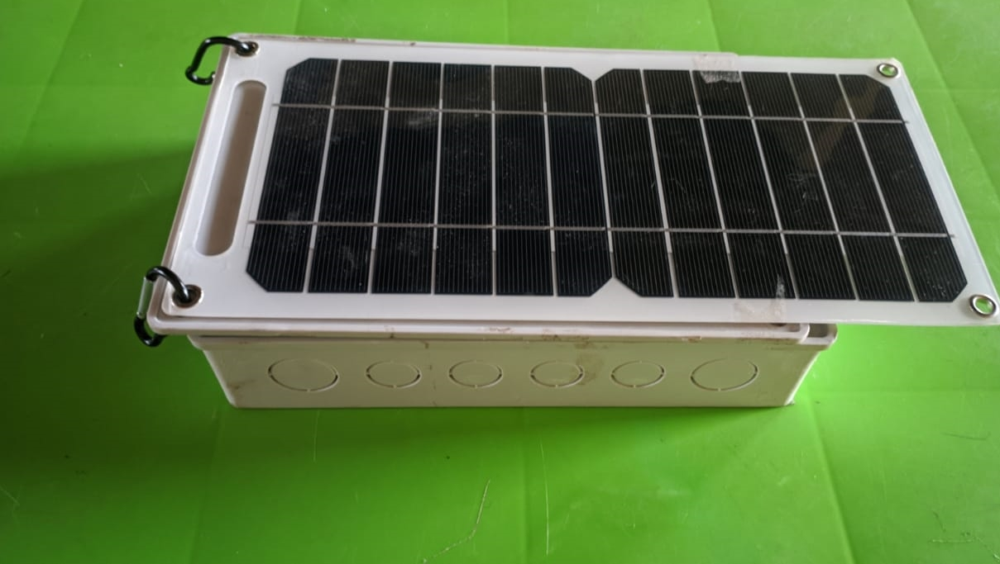

# CarbonZ - IoT Device for Carbon Emissions Monitoring

CarbonZ is an innovative IoT device designed to enable companies and individuals to track and monitor their carbon emissions accurately and easily. The device integrates multiple sensors to measure environmental parameters and leverages machine learning to convert raw sensor values into real-time CO2 concentration readings.

## Key Features

- Accurate Emission Monitoring: CarbonZ utilizes the following sensors to capture environmental data:
  - MG811: Measures CO2 concentration.
  - MQ7: Detects carbon monoxide (CO) levels.
  - MQ9: Measures the concentration of carbon monoxide (CO), methane (CH4), and other combustible gases.
  - MQ135: Detects air quality, including hazardous gases.
  - BME280: Monitors temperature and humidity.

- Machine Learning Model: **We have developed a machine learning model deployed on AWS Elastic Beanstalk**, which processes the raw sensor values to provide precise CO2 concentration estimations. The model has been trained using a calibration dataset that correlates the sensor readings with actual CO2 emissions in the atmosphere.

- IoT Connectivity: The CarbonZ IoT device is powered by ESP8266, which offers embedded Wi-Fi connectivity for seamless data transmission to our cloud-based platform.

- Cost-Effective Solution: Our aim is to make carbon emissions tracking accessible to all. By utilizing affordable sensors and leveraging existing hardware capabilities, we have optimized the cost of implementation without compromising on accuracy.

- Offset Integration: CarbonZ is a subsidiary of our larger CarbonZ platform, which allows users to offset their carbon emissions. By monitoring emissions with CarbonZ, users gain valuable insights to support their offsetting efforts effectively.

## Reproducing CarbonZ

To Reproduce CarbonZ and start monitoring your carbon emissions, follow these steps:

1. Build the IoT Device (We've made Schematics Open source): Connect the CarbonZ IoT device to a power source and ensure it is connected to the internet via Wi-Fi.

2. Calibration: Before using the device, it needs to be calibrated. Collect raw sensor values over a period of time along with actual CO2 emissions data. This calibration dataset will be used build a machine learning model to convert the sensor readings into CO2 concentration.

3. API Integration: Deploy your ML model as an API endpoint or use ours here (`http://chemotronix-calibration-env.eba-hp5mrvst.us-east-1.elasticbeanstalk.com/predict`) to send sensor readings for CO2 concentration prediction. Use the provided Python sample code or integrate the API into your preferred programming language.

4. Retrieve Results: The API will return the estimated CO2 concentration based on the sensor readings. Incorporate this information into your monitoring or reporting systems for further analysis and decision-making.


* Python Request sample.

```
import requests
import json

url = "http://chemotronix-calibration-env.eba-hp5mrvst.us-east-1.elasticbeanstalk.com//predict"

payload = json.dumps({
  "Temperature": 29.62999916,
  "Humidity": 71.56738281,
  "MQ7_analog": 4440,
  "MQ9_analog": 6218,
  "MG811_analog": 3775,
  "MQ135_analog": 3828,
  "MG811_Digital": 0,
  "MQ7_Digital": 1
})
headers = {
  'Content-Type': 'application/json'
}

response = requests.request("POST", url, headers=headers, data=payload)

print(response.text)


```

## Contributing

This Project will remain open source after the Hackathon. We welcome contributions to CarbonZ. If you have any ideas, improvements, or bug fixes, please submit them as pull requests or raise an issue in our GitHub repository.

## License

CarbonZ is released under the [MIT License](https://opensource.org/licenses/MIT). Feel free to use, modify, and distribute this project in accordance with the terms of the license.

## Contact

For any inquiries or feedback, please reach out to our team.

## Acknowledgments

**This Project was built for the Chainlink 2023 Hackathon**, We would like to express our gratitude to the organizers of the Chainlink Hackathon for providing the opportunity to develop and showcase CarbonZ.


# IoT Images

Inside_the_IoT_device_prototype


Inside_the_IoT_device_prototype



IoT sending data live to AWS for Calibration.


