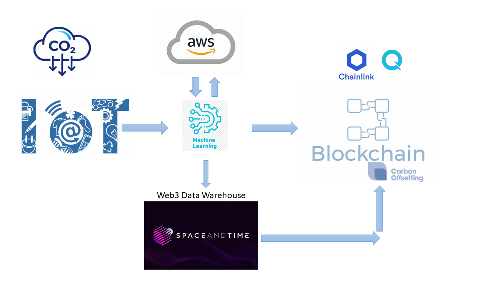
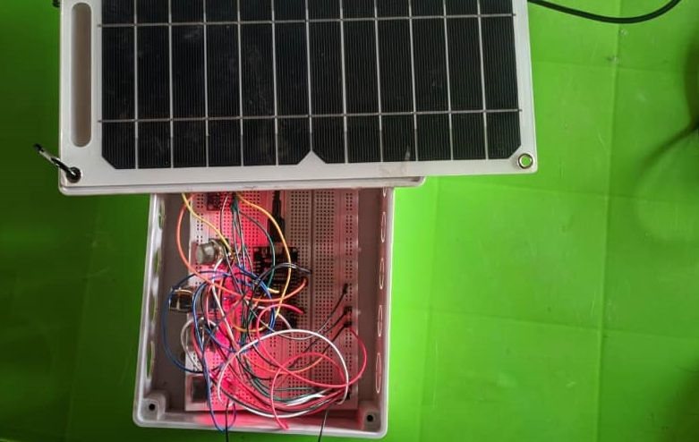

# About CarbonZ

The CarbonZ project combines **IoT, AI, and Blockchain** technologies to provide a comprehensive solution for offsetting carbon emissions. By leveraging IoT devices equipped with sensors, we monitor and track environmental parameters to accurately measure carbon emissions. Our advanced calibration strategy, powered by AWS, ensures precise data interpretation.

With the collected data, our AI algorithms convert raw sensor values into real-time CO2 concentration readings, enabling individuals and organizations to monitor their carbon footprint easily and accurately. Additionally, **we leverage Blockchain technology to facilitate seamless and transparent carbon offsetting**, empowering users to take proactive steps towards environmental sustainability.

The data from the IoT device is also analyzed using A.I such that stakeholders can forecast carbon emissions and take actions 
to gradually reduce it.

## Chainlink for CarbonZ

Chainlink expands smart contracts by allowing them to connect to real-world servers and data feeds making it possible to get information in and out of a blockchain in a secure, trustworthy, and decentralized manner. 

There are Certain functions in the CarbonZ business logic that need to be automated, we have been able to leverage Chainlink to make this possible. We used Chainlink keepers to automate the functionalities in the contract on a time basis using the time Upkeep feature.

Click here to view our [Chainlink Project Time Upkeep](https://automation.chain.link/mumbai/3543656684294654056459503913455770424444445795518957845146294887268745730796)

## AWS & IoT for CarbonZ

#### Key Features

- Accurate Emission Monitoring: CarbonZ utilizes the following sensors to capture environmental data:
  - MG811: Measures CO2 concentration.
  - MQ7: Detects carbon monoxide (CO) levels.
  - MQ9: Measures the concentration of carbon monoxide (CO), methane (CH4), and other combustible gases.
  - MQ135: Detects air quality, including hazardous gases.
  - BME280: Monitors temperature and humidity.

- Machine Learning Model: **We have developed a machine learning model deployed on AWS Elastic Beanstalk**, which processes the raw sensor values to provide precise CO2 concentration estimations. The model has been trained using a calibration dataset that correlates the sensor readings with actual CO2 emissions in the atmosphere.

- IoT Connectivity: The CarbonZ IoT device is powered by ESP8266, which offers embedded Wi-Fi connectivity for seamless data transmission to our cloud-based platform.

- Cost-Effective Solution: Our aim is to make carbon emissions tracking accessible to all. By utilizing affordable sensors and leveraging existing hardware capabilities, we have optimized the cost of implementation without compromising on accuracy.

## Quicknode for carbonZ

Leveraging Quicknode, it enabled us to build a scalable blockchain ecosystem. Polygon was used to create an ERC-20 token called Coz, which essentially serves as carbon credits for users to trade on the blockchain, enabling carbon emitters to effectively offset their carbon emissions as they were tracked by the IoT device.

Graph Protocol was used to query the blockchain, while Quicknode was used to host an RPC node through which our dApp was able to retrieve blockchain information.

The ERC-20 Token smart contract among several other functionalities has been deployed, and it is currently active on the Polygon Testnet Explorer here: https://mumbai.polygonscan.com/address/0x8abedecd3e48e67ec3ddb3b21df68c6b57f557d8

## Deploy link

The web version is currently deployed at https://carbon-z.netlify.app/

## Stack.

## IoT Images

The IoT device Prototype

IoT sending data.

## Technologies Used

